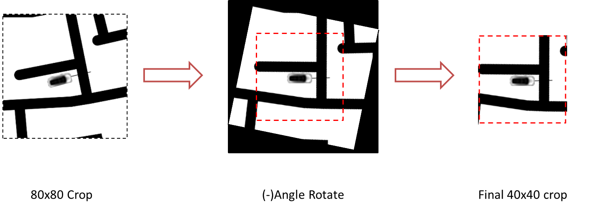

# Twin Delayed DDPG (T3D): Implementation


### Results 

Will update with a better video later.. maybe. Not sure.

[](https://www.youtube.com/watch?v=qHL6q6XU57g)

`gym_dabbewala/envs/dabbewala_env.py` : is the environment, can be modified if wished.

`test_env.py`: file to test environment modifications.

`ai.py`: contains the TD3 class

`train_agent.py` to train the environment for 500k steps. **use this if you want to train from scratch **

`test_agent.py` : do the inference. **just run this to see results**

`TD3_V3_1M.ipynb` : Notebook containing the whole training process.

## Environment:

Reasons to create the environment:

1. I was already working on creating a custom GYM env. This assignment gave me a push to finish that task.

2. Laptop didn't have enough juice to run both the training and netflix:Dark at the same time.

3. Also, couldn't make kivy run on colab.

The environment code has been commented well, however below is some basic overview in the context of solving the assignment problem.

Render: is done using `pygame`.(install it if not already), tried building that with python native `turtle` module, but car rotation animation wasn't easy.

### States

The solution has two states:

**State1:** which I am calling ***Vision State*** is the output from the 40x40 image crop around the car.

**NOTE**: Car is for representation purpose only, car was not part of the surrounding crop.

  

**State2**: a vector of other state parameters.

#### State1: The Vision State

- This state is generated from the ***40x40 Angled Crop*** of the Road image keeping the car in the center.
- Angled crop represents the current vision state of the car perfectly.
- It's a very simple 4 layer CNN. (in some experiments even smaller networks worked just fine)

- This CNN class takes in 40x40 input and gives an 5x5 tensor output, which I am calling ***Vision State.***

```python
class AC_conv(nn.Module):
    def __init__(self, state_dim=1):
        super(AC_conv, self).__init__()
        self.conv1 = nn.Conv2d(state_dim, 16, kernel_size=3, stride=2) # 16 
        self.bn1 = nn.BatchNorm2d(16)
        self.conv2 = nn.Conv2d(16, 16, kernel_size=3, stride=1) # 16
        self.bn2 = nn.BatchNorm2d(16)
        self.conv3 = nn.Conv2d(16, 9, kernel_size=3, stride=1) # 9 : 15x15
        self.bn3 = nn.BatchNorm2d(9)  # sq of an odd number, because just!
        self.conv4 = nn.Conv2d(9, 1, kernel_size=1) # 1 : 15x15 | combining 9ch to 1

    def forward(self, x):
        # final output is 5x5 which later be flattened to 25
        x = F.relu(self.bn1(self.conv1(x)))
        x = F.relu(self.bn2(self.conv2(x)))
        x = F.relu(self.bn3(self.conv3(x)))
        x = F.relu(self.conv4(x))
        return torch.nn.functional.avg_pool2d(x, kernel_size=3, stride=3) # 5x5 
```

* This output later will be flattened to 25 and concatenated to other state values.

#### State2:

- Second part of the state contains a vector of:
  `[distance, orientation, -orientation, angle, angle]`
- This was an overkill, but these state values stayed in the code.
- State1 and State2 are concatenated and fed into simple two layer DNN to Create Actor Networks

### Actions

Continuous Action Space, with two actions with range [-20,20]

**Roatation:** is the predicted rotation angle for the car to take a turn.

**Speed**: action range is squeezed between [3,6], to make the car always run.(was completely unnecessary)

### Reward and done condition

Reward:
        if the car is on the sand:
            reward = -1.5
        else: # being on road
            reward = -0.6
            if distance < last_distance:
                reward = -0.01
Done:
1. When car picks up the object and delivers.
2. When Episode is over

## Some TD3 Stuff

### Replay Memory
This is how the Experience was stored:
***(s1,s2, a, s1', s2', r)*** :: (state1, state2, action, new_state1, new_state2, reward)

- ***state1***: current ***Vision state*** of agent; 40x40 crop of surrounding of the car.
- ***state2***: current ***orientation state*** of agent; `[distance, orientation, -orientation, angle, angle]`
- ***a***: action taken by agent to move to next state
- ***state1'***: next ***Vision state*** of agent; 40x40 crop of surrounding of the car.
- ***state2'***: next ***orientation state*** of agent; `[distance, orientation, -orientation, angle, angle]`
- ***r***: reward received by the agent for taking the action(***a***)
- **done**: true/1 if the env 'is finished/game over/ or needs a reset


#### Actor Networks

* Actor networks inherits the VisionState class and builds on top of it.

* Flattened State1, and State2 are concatenated; and fed into a 2 layers DNN.

* This gives 2 Action outputs.

  `Rotation` and `Speed`

```python
class Actor(AC_conv):
    def __init__(self, state_dim, action_dim, max_action):
        AC_conv.__init__(self)
        super(Actor, self).__init__()
        linear_input_size = 25+5
        self.layer_1 = nn.Linear(linear_input_size, 30)  # if on road or sand
        self.layer_2 = nn.Linear(30, 50)
        self.layer_3 = nn.Linear(50, action_dim)
        self.max_action = max_action

    def forward(self, x1, x2):
        x1 = AC_conv.forward(self, x1)
        # Final concatenated state vector:
        x = torch.cat(((x1.view(x1.size(0), -1)),
                       x2), 1) 
        x = F.relu(self.layer_1(x))
        x = F.relu(self.layer_2(x))
        return self.max_action * torch.tanh(self.layer_3(x))
```

### Critic Networks

- Critic Networks also inherits the VisionState class and builds on top of it.
- Flattened State1,  State2 and redicted Action values `a` (referred as`u` in network) are concatenated; and fed into a 2 layers DNN.
- So we get the idea about how network structure. Detailed code in the `ai.py` file.

### Training:

* Trained on Google Colab for 1M timesteps.

### Inference:

* done locally after downloading the model weight files.


