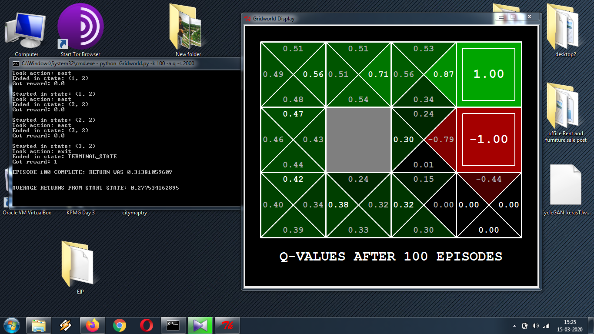

# Assignment P2S6 : Q-learning Agents for Gridworld

#### Question 1 (50 pts)  
Upload the image of the program (with graphics) running on your computer
**Ans:** 

#### Question 2 (25 pts)  
Write a the pseudo-code (if you paste direct code, will be awarded 0) for `__init__` 

**Ans:**

    INITIALIZE Q-values Counter

#### Question 3 (25 pts)  
Write a the pseudo-code (if you paste direct code, will be awarded 0) for `getQValue`  
**Ans:**

    FUNCTION Q(state,action)
      IF we have never seen a state RETURN 0.0 
      ELSE the Q node value otherwise
      
#### Question 4 (25 pts)  
Write a the pseudo-code (if you paste direct code, will be awarded 0) for `computeValueFromQValue`  
**Ans:**

    COMPUTE legal actions for each state
      IF no legal actions RETURN  0.0
    RETURN max of qvalues of all actions at states
      
#### Question 5 (25 pts)  
Write a the pseudo-code (if you paste direct code, will be awarded 0) for `computeActionFromQValues`  
**Ans:**
    
    COMPUTE Legal Actions for each state
       IF no legal actions RETURN  0.0
    GET Qvalue for all actions and their states
      RETURN action for max Qvalue

#### Question 6 (25 pts)  
Write a the pseudo-code (if you paste direct code, will be awarded 0) for `getAction`  
**Ans:** 

    COMPUTE Legal Actions for each state
      IF action legal
        THEN IF ExplorationProb MORETHAN Random choice
          THEN random Action
        ELSE COMPUTE Action from computeActionFromQValues()
      
      ELSE RETURN action

#### Question 7 (25 pts)  
Write a the pseudo-code (if you paste direct code, will be awarded 0) for `update`  
**Ans:** 
USE %3D%5C%3AQ_%7Bt-1%7D%5Cleft(s%2C%5C%3Aa%5Cright)%5C%3A%2B%5C%3A%5Calpha%20TD_t%5Cleft(a%2C%5C%3As%5Cright)) to update q value

    Temporal difference = reward +(discount * optimum future value) - Q_old
    
    Q_new = Q_old +Learning rate*temporal difference

